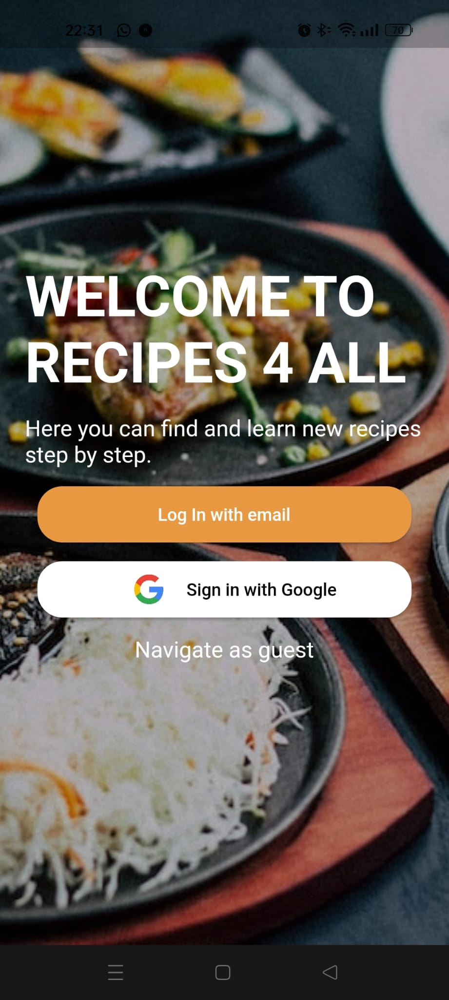

# Recipes 4 All
<h3 align="center">🏗️Under development🏗️</h3>

&nbsp;&nbsp;&nbsp;&nbsp;&nbsp;&nbsp;&nbsp;&nbsp;&nbsp;&nbsp;&nbsp;&nbsp;&nbsp;&nbsp;&nbsp;&nbsp;&nbsp;&nbsp;&nbsp;
Recipes 4 All is an app that show to users how to make recipes.  

## Table of content
- [Licence](#license)
- [Install](#install)
- [Functionalities](#functionalities)
- [Screenshots](#screenshots)
- [Built with](#built-with)
- [Final Notes](#final-notes)
- [Authors](#authors)

## License
Coming soon

## Install
Not availabale yet! ⚠️  
This app is currently only available for Android devices. 
Requirements minimum Android version 5.0 Lollipop.  
<!-- Click on this <a href="https://drive.google.com/file/d/1_waqtASnBfk2ITtdNhKs4gGp8ZEZwHg9/view?usp=drivesdk">link</a> to download it! -->

## Functionalities
-Welcome page
- Account
  - Register.
  - Login with google. (under development)
  - Login with email and password.
  - Navigate as guest
  - Reset password.
  - Splash Screen. 
- Home Screen
  - Bottom navigation bar.
  - Drawer menu to navigate.
  - Main Swipper. (under development).
  - Categories Swipper.
  - Search recipes.
  - Popular recipes. (under development).

- Shopping List (under development)
- Favorites (under development)
- My profile
  - Add a profile picture. (under development).
  - Update your username and email. 
<!--   - Reset password.
  - Delete account. -->
  - Log Out
- Category Page
  - Show a preview recipes in this category.
- Recipe Page
  - Show the detailed recipe.
  - Show the servings and the servings.
  - Like and save recipes. (under development).
- Add Recipe
  - Save recipe info. (under development)
  - Upload it. (under development)
<!-- - Settings
  - Read terms and conditions.
  - Theme is setted by the Android.
  - Change language (Portuguese, English). -->

## Screenshots
Welcome Screen 

## Built with
<a href="https://developer.android.com/studio">Android Studio</a> - IDE (Integrated Development Environment)  
<a href="https://flutter.dev">Flutter</a> - Framework 
<a href="https://dart.dev">Dart</a> - Programing Language 
<a href="https://firebase.google.com">Firebase</a> - Database 
<a href="https://www.freepik.com">FreePik</a> - Image bank  
<a href="https://unsplash.com">Unsplash</a> - Image bank  
<a href="https://app-privacy-policy-generator.firebaseapp.com">App Privacy Policy Generator</a> - Privacy policy generator

## Authors
- [José Lopes](https://www.github.com/joselopes04)
